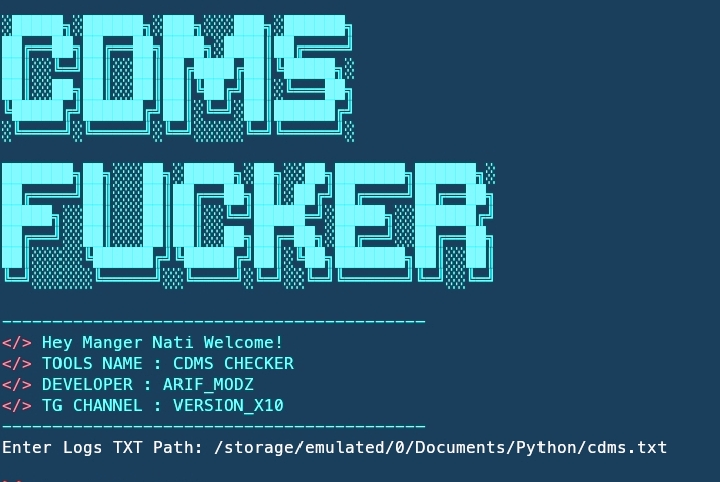

# CDMS-AUTO-LOGIN

    

## What is this

Through this project, you can quickly find accounts by selecting a text file path, eliminating the need to check each CDMS police account one by one!

## Used Languages

- **PHP**
- **Python**
- **JavaScript**

## Installation

To get a local copy up and running, open your terminal and run the following command:
pkg update && pkg upgrade
pkg install git
pip install requests
git clone https://github.com/Versionx10/CDMS-AUTO-LOGIN.git
cd CDMS-AUTO-LOGIN
python main.py

Single line command.

pkg update && pkg upgrade && pkg install git && pip install requests && git clone https://github.com/Versionx10/CDMS-AUTO-LOGIN.git && cd CDMS-AUTO-LOGIN && python main.py
